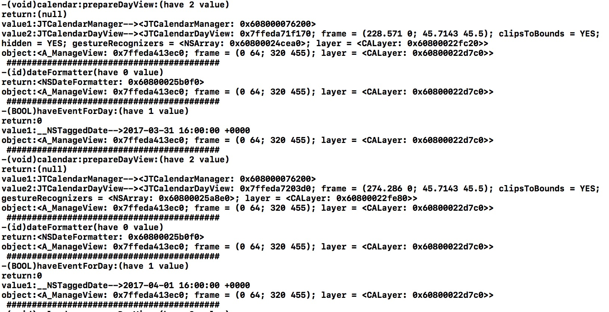
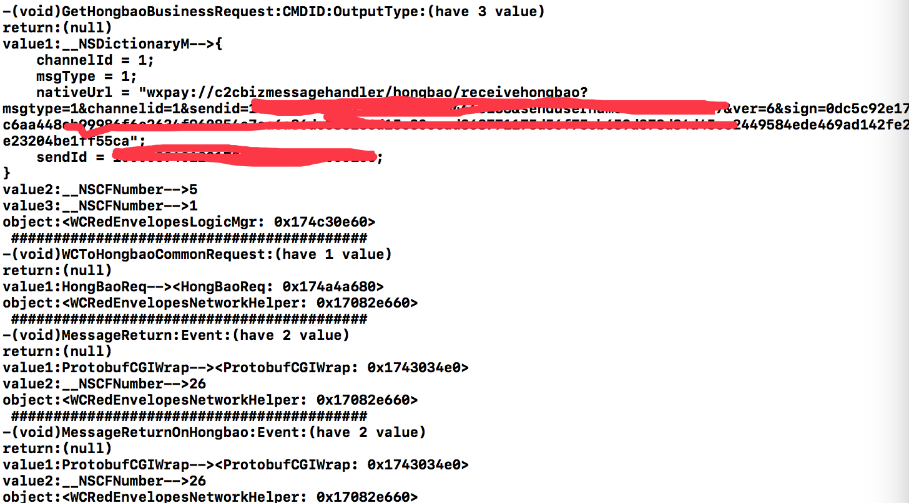

# BigBang

性能损耗
| 不加之前 | 0.000459s/20000次 |
| 加之后 | 0.002s/20000次 |

| Tables        | Are           | Cool  |
| ------------- |:-------------:| -----:|
| col 3 is      | right-aligned | $1600 |
| col 2 is      | centered      |   $12 |
| zebra stripes | are neat      |    $1 |

作者：Te_Lee
链接：http://www.jianshu.com/p/1e402922ee32/
來源：简书
著作权归作者所有。商业转载请联系作者获得授权，非商业转载请注明出处。

勾某个类的所有方法的，查看所有方法的执行顺序

使用方法

[BigBang hookClass:@"A_ManageViewController"];

常规使用：

放在只执行一次的函数里，防止多次勾一个函数
如

- (BOOL)application:(UIApplication *)application didFinishLaunchingWithOptions:(NSDictionary *)launchOptions

hook：

__attribute__((constructor)) static void entry()

放这里面

打日志的printf 改成 nslog

在终端那个应用里面就能看到日志

  

微信

[BigBang hookClass:@"WCPayLogicMgr"];

[BigBang hookClass:@"WCRedEnvelopesLogicMgr"];

[BigBang hookClass:@"ContactUpdateHelper"];

[BigBang hookClass:@"WCRedEnvelopesNetworkHelper"];

[BigBang hookClass:@"WCRedEnvelopesReceiveHomeView"]

  
